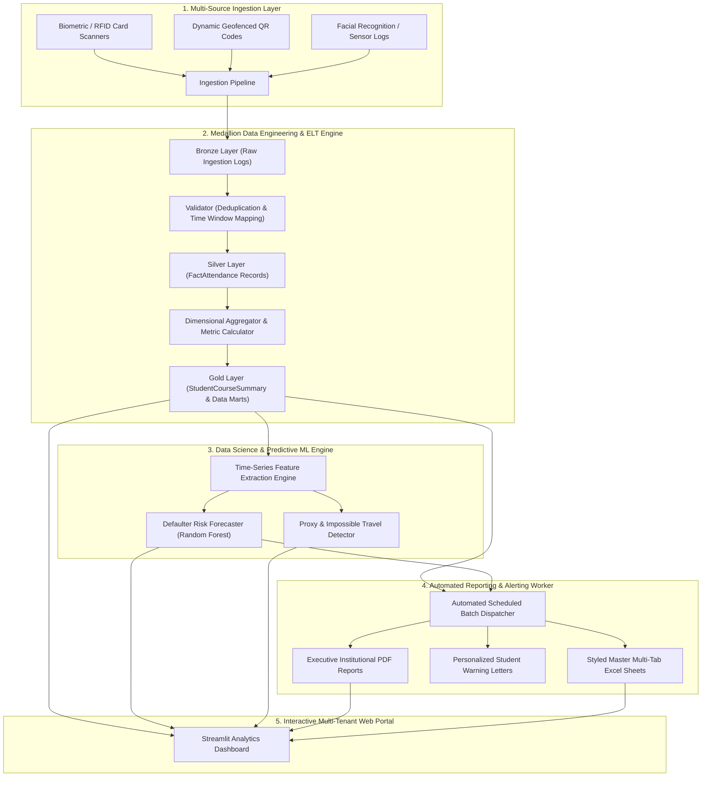

# 🎓 UniAttend 360: Universal Automated Attendance Analytics & Predictive Intelligence Platform

[](https://www.python.org/)
[-orange.svg)]()
[]()
[]()
[]()
[]()

> **UniAttend 360** is an enterprise-grade, multi-tenant automated student attendance tracking, data engineering pipeline, and predictive analytics platform engineered for modern colleges and universities.

---

## 📌 Executive Summary & Problem Statement

In higher education institutions, manual roll-calls and fragmented biometric silos cause severe operational friction:
* **Proxy Attendance & Fraud:** Up to 15% of attendance marks in large lecture halls are fraudulent proxy swipes.
* **Delayed Defaulter Identification:** Students falling below statutory exam thresholds (e.g. 75% attendance criteria) are often only identified at the end of the term, leaving zero recovery window.
* **Reporting Bottlenecks:** Manual generation of department compliance sheets, student warning letters, and executive deanship reports consumes hundreds of administrative hours.

**UniAttend 360** solves this with an end-to-end automated platform featuring **multi-source ingestion**, **Medallion ELT processing**, **predictive shortage forecasting**, **automated institutional PDF/Excel dispatching**, and an **interactive multi-role analytics web application**.

---

## 🏛️ End-to-End System Architecture



---

## 🌟 Key Technical Modules

### 1. 🗄️ Multi-Tenant Relational Data Modeling & Star Schema
* **Multi-Tenancy:** Hierarchy supports `University` $\to$ `College` $\to$ `Department` $\to$ `Course` $\to$ `TimetableSession` $\to$ `Student` $\to$ `Faculty`.
* **Medallion Architecture:**
  - **Bronze (`bronze_raw_attendance_logs`):** Append-only raw logs capturing scan timestamp, device ID, room code, and IP/geolocation.
  - **Silver (`silver_fact_attendance`):** Cleaned, deduplicated, session-linked fact table with `PRESENT`, `LATE`, and `ABSENT` status.
  - **Gold (`gold_student_course_summary`):** High-performance dimensional aggregates with attendance percentages, consecutive streaks, and risk scores.

### 2. ⚡ High-Throughput ELT & Validation Engine
* **Instant Deduplication:** Algorithmic suppression of rapid double-taps within a configurable time window (e.g. $<60$s).
* **Dynamic Time Window Mapping:** Matches scan events to physical classrooms and scheduled lecture slots ($[T_{start} - 20\text{m}, T_{start} + 45\text{m}]$), automatically tagging late arrivals ($>15\text{m}$).
* **Defaulter & Recovery Math Formulation:**
  $$\text{Classes Needed to Reach 75\%: } N = \max\left(0, \lceil 3T - 4A \rceil\right)$$
  $$\text{Classes Can Afford to Miss: } M = \max\left(0, \lfloor \frac{4A - 3T}{3} \rfloor\right)$$
  *(where $T = \text{Total Classes Held}$, $A = \text{Attended Classes}$)*.

### 3. 🤖 Predictive Machine Learning & Proxy Detection
* **Defaulter Risk Forecaster:** Supervised ensemble model predicting whether an at-risk student will fail the 75% end-of-semester criteria using early 4-week attendance velocity, day-of-week slump factors (e.g. Friday absenteeism), and consecutive absence streaks.
* **Explainable AI:** Computes feature attribution to provide plain-language reasons for risk flags (e.g. *"Sharp 16% decline in recent weeks"*, *"High morning session absenteeism"*).
* **Proxy Anomaly Radar:** Detects impossible travel speeds across distant classrooms within short intervals and "Card Dumping" bursts.

### 4. 📄 Automated Institutional Reporting Engine
* **Multi-Tab Stylized Excel Workbooks (`openpyxl`):**
  - Tab 1: Executive KPI Dashboard & Department League Table.
  - Tab 2: Master Student Matrix with conditional formatting (🟢 $\ge 80\%$, 🟡 $75-79\%$, 🔴 $<75\%$).
  - Tab 3: Actionable Defaulter Roster with recovery requirements.
* **Institutional PDF Digest & Warning Letters (`reportlab`):**
  - Deanship Audit PDFs with summary tables and official signature blocks.
  - Personalized Academic Attendance Deficiency Notices issued automatically to students/guardians.

### 5. 🖥️ Interactive Web Analytics Portal
* **Executive Dean View:** Campus-wide KPI cards, attendance heatmaps, and department league tables.
* **Faculty View:** Subject tracker, lecture-by-lecture drill-down, and one-click defaulter export.
* **Student 360 & What-If Simulator:** Interactive calculator allowing students to simulate how attending or missing future classes affects their exam eligibility.
* **Export Center:** Live on-demand PDF and Excel downloads.

---

## 📁 Project Directory Structure

```text
uniattend-analytics/
├── app/
│   ├── __init__.py
│   └── streamlit_app.py         # Multi-tenant interactive web dashboard
├── data/
│   ├── __init__.py
│   └── data_generator.py        # Multi-tenant synthetic academic & sensor data generator
├── database/
│   ├── __init__.py
│   ├── models.py                # Multi-tenant Star Schema & SQLAlchemy 2.0 ORM
│   └── db_manager.py            # Database engine and connection lifecycle manager
├── ml_engine/
│   ├── __init__.py
│   ├── feature_builder.py       # Time-series and momentum feature engineering
│   ├── risk_predictor.py        # Random Forest defaulter prediction model
│   └── proxy_detector.py        # Spatio-temporal anomaly & proxy detection
├── pipeline/
│   ├── __init__.py
│   ├── validator.py             # Deduplication and time-window business rules
│   └── etl_pipeline.py          # Bronze -> Silver -> Gold transformation pipeline
├── reporting/
│   ├── __init__.py
│   ├── excel_reporter.py        # Formatted multi-tab Excel generator (openpyxl)
│   ├── pdf_reporter.py          # Executive PDF & Warning Letter generator (ReportLab)
│   └── automated_job.py         # Nightly batch cron scheduler
├── tests/
│   ├── test_pipeline.py         # Ingestion and ELT pipeline tests
│   ├── test_ml.py               # Feature building and ML inference tests
│   └── test_reporting.py        # PDF and Excel generation validation tests
├── output/                      # Generated reports and warning letters
│   ├── reports/
│   └── letters/
├── run.py                       # Unified CLI application runner
├── requirements.txt             # Python dependencies
└── README.md                    # System documentation and portfolio guide
```

---

## 🚀 Quickstart & Setup Guide

### 1. Clone & Set Up Virtual Environment
```bash
cd D:\uniattend-analytics
python -m venv venv
.\venv\Scripts\activate
pip install -r requirements.txt
```

### 2. Run the End-to-End Platform (Seed $\to$ ELT $\to$ ML $\to$ Reports $\to$ App)
```bash
python run.py --all
```

### 3. Granular CLI Commands
* **Seed database with universities, courses, and raw swipe logs:**
  ```bash
  python run.py --seed
  ```
* **Execute Bronze $\to$ Silver $\to$ Gold ELT Pipeline:**
  ```bash
  python run.py --etl
  ```
* **Train ML Defaulter Forecaster:**
  ```bash
  python run.py --train-ml
  ```
* **Audit for Proxy Swipes & Spatio-Temporal Anomalies:**
  ```bash
  python run.py --audit-proxy
  ```
* **Generate all Excel Workbooks and PDF Warning Letters:**
  ```bash
  python run.py --reports
  ```
* **Launch Interactive Web Portal:**
  ```bash
  python run.py --app
  ```
  *(Access at `http://localhost:8501`)*

---

## 🧪 Test Suite Execution

Run the complete test suite to verify pipeline integrity, ML accuracy, and document rendering:
```bash
pytest tests -v
```

---

## 💼 Interview Talking Points (Data Engineering & Data Science)

When discussing this project in corporate interviews for **Data Engineering** or **Data Science / ML Engineering** roles, highlight these points:

1. **Dimensional Data Modeling & Multi-Tenancy:**
   * *"Designed a multi-tenant relational schema capable of scaling across multiple universities and campuses while partitioning raw IoT logs into Bronze, Silver, and Gold Medallion layers."*
2. **Data Pipeline Architecture & Idempotency:**
   * *"Implemented deduplication rules and dynamic timestamp matching to map noisy RFID/QR scan streams to academic timetable sessions, handling late arrivals, out-of-boundary scans, and absentee imputation."*
3. **Applied Machine Learning & Predictive Modeling:**
   * *"Engineered time-series momentum features (e.g. early-vs-late slope, day-of-week slump rates) to train an explainable Random Forest classifier that forecasts exam defaulters weeks in advance for proactive academic intervention."*
4. **Fraud & Anomaly Detection:**
   * *"Combined rule-based spatio-temporal impossibility heuristics with clustering to flag card-dumping and simultaneous multi-classroom proxy check-ins."*
5. **Automated Business Reporting:**
   * *"Architected an automated reporting dispatcher that programmatically generates multi-tab formatted Excel workbooks and legal PDF warning notices for university deans and guardians."*

---

## 📄 License
This project is open-source and available under the [MIT License](LICENSE).
